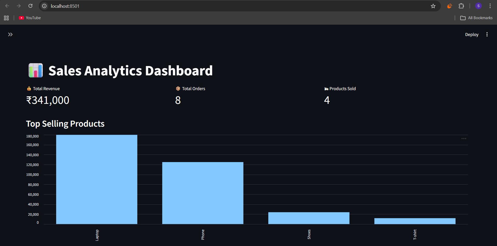

# 📊 Sales Analytics Pipeline & Dashboard

An end-to-end **Sales Data Analytics project** that processes raw sales data using **Python ETL**, stores it in **PostgreSQL**, and visualizes insights through an **interactive Streamlit dashboard**.

---

## ⚡ Tech Stack

* Python
* Pandas / NumPy
* PostgreSQL
* SQLAlchemy
* Matplotlib
* Streamlit

---

## ✨ Key Features

* Built a **Python ETL pipeline** to extract, clean, and transform sales data
* Loaded processed data into **PostgreSQL database**
* Wrote **SQL aggregation queries** for analytics insights
* Generated **automated sales reports** using Matplotlib
* Developed an **interactive Streamlit dashboard** with KPIs and filters

---

## 📊 Dashboard Preview



---


## 🧠 Insights Generated

* Top Selling Products
* Revenue by Region
* Category Performance
* Monthly Revenue Trends

---

## ▶️ Run Locally

```bash
pip install -r requirements.txt
python -m streamlit run scripts/dashboard.py
```

---

## 👨‍💻 Author

**Shitanshu Badwaik**
